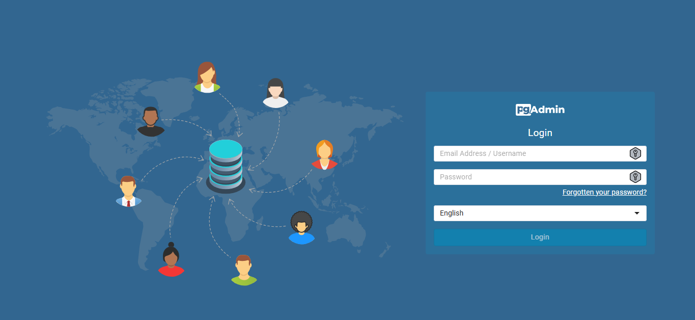
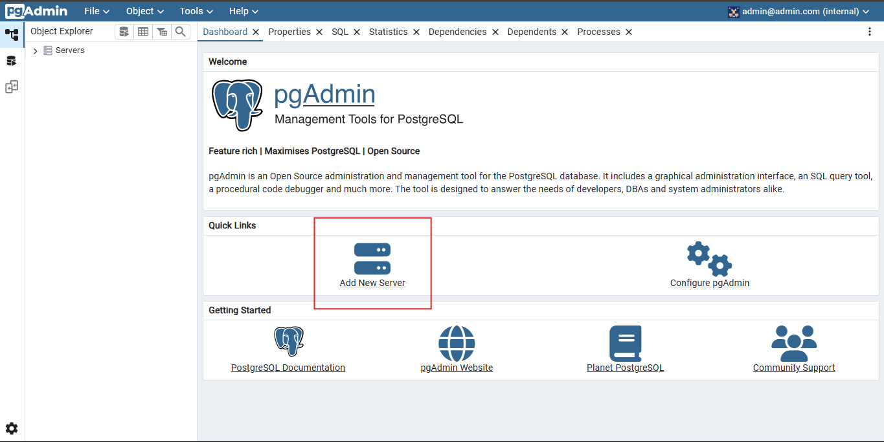
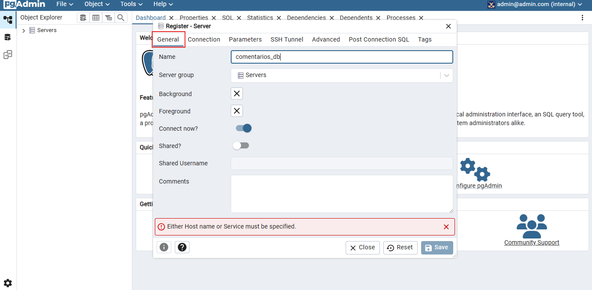
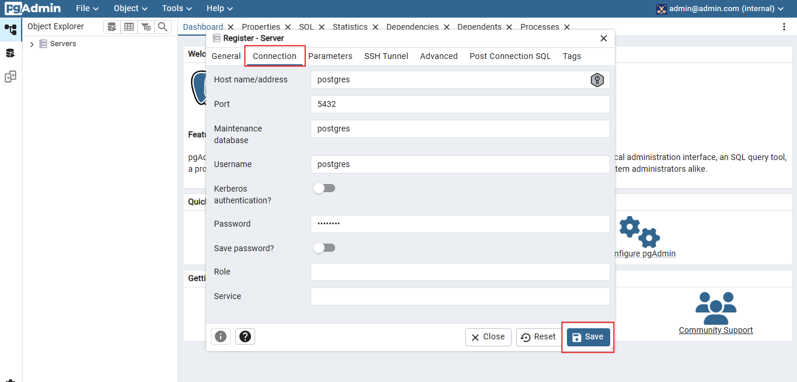
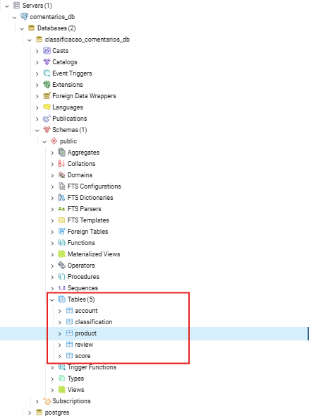

# Passo a passo para acessar o pgAdmin

### 1. Navegue até: http://localhost:5050/
 

- **Usuário:** admin@admin.com
- **Senha:** admin

### 2. Clique em 'Add new server'

### 3. Dê um nome para o seu banco de dados

- **Nome:** eu coloquei `comentarios_db` mas pode ser qualquer nome.

### 4. Preencha os campos de conexão corretamente

- **Host name:** `postgres`
- **Port:** `5432`
- **Maintenance database:** `postgres`
- **Username:** `postgres`
- **Password:** `postgres`\
E clique em 'Save'

### 5. Verifique as tabelas criadas!

